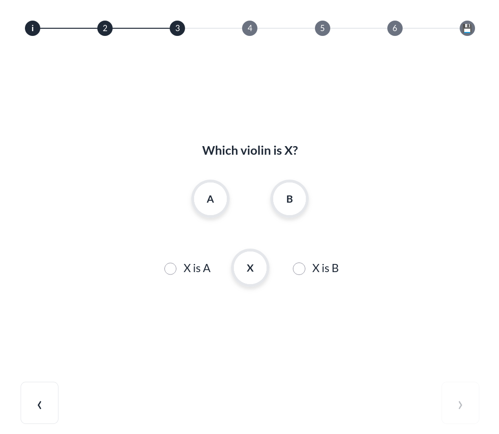

# WebAudio Listening Test Toolkit

A lightweight, flexible, and researcher-friendly web interface for conducting audio listening tests. This toolkit supports **Similarity Rating**, **ABX Testing**, and even **Mixed Paradigms**—all configurable via a single, human-readable YAML file.



## Key Features

- **No Build Step:** Uses vanilla JavaScript and Web Components. Works immediately via any local server.
- **Dual Paradigms:**
  - **Similarity:** Judge the difference between two sounds on a customizable scale (e.g., 0 to 10).
  - **ABX:** Identify if sound X matches reference A or B.
- **Mixed Mode:** Combine different test types in a single session.
- **Self-Contained Config:** No need to touch the code. Define your rounds, instructions, and scales in `config.yaml`.
- **Flexible Results:** Automatic results download or direct submission via Webhooks (Make.com, Pipedream, etc.).

---

## Quick Start

1. **Clone the repository:**
   ```bash
   git clone https://github.com/your-username/listening-tests.git
   cd listening-tests
   ```

2. **Start the server:**
   The interface requires a server to load audio files and the YAML configuration.
   ```bash
   python server.py
   ```
   *This will automatically open your browser to `http://localhost:8000`.*

3. **Configure your test:**
   Edit `config.yaml` to add your audio files and instructions.

---

## Configuration (`config.yaml`)

The toolkit is entirely driven by the `config.yaml` file. Here is a breakdown of the main sections:

### Global Settings
- `testType`: Default paradigm for the whole test (`similarity` or `abx`).
- `audioRoot`: The folder where your audio files are stored (relative to the project root).
- `validate`: (Boolean) If `true`, users must provide an answer before moving to the next round (currently enforced for ABX).

### Paradigms
```yaml
similarity:
  scale: 
    min: 0
    max: 10
    default: 5
    labels: { min: "Same", max: "Different" }
  instruction: "Rate the difference:"

abx:
  instruction: "Which violin is X?"
```

### Defining Rounds
You can define your test rounds using direct filenames:
```yaml
test:
  rounds:
    - a: "violin_1.wav"
      b: "violin_2.wav"
    - type: "abx" # Optional override
      a: "ref_A.wav"
      b: "ref_B.wav"
      x: ["test_1.wav", "test_2.wav"] # If a list, one is picked at random
```

---

## Saving Results

By default, when a user clicks "Save," the toolkit generates a JSON file and prompts the user to download it.

### Automated Collection with Make.com

To collect results automatically into a Google Sheet or database:

1. **Create a Webhook:**
   - Log in to [Make.com](https://www.make.com/).
   - Create a new Scenario and add the **Webhooks** module with a "Custom Webhook."
   - Copy the URL provided by Make.
2. **Update Config:**
   - Paste the URL into the `webhookUrl` field in your `config.yaml`.
3. **Handle the Data:**
   - Add a second module in Make (e.g., "Google Sheets: Add a Row").
   - Perform a test run to let Make "see" the structure of the incoming JSON data.
   - Map the `test` and `result` fields to your spreadsheet columns.

---

## Directory Structure

```text
listening-tests/
├── audio/            # Put your .wav/.mp3 files here
├── config.yaml       # YOUR CONFIGURATION (Start here!)
├── index.html        # Main entry point
├── main.js           # App logic
├── server.py         # Local Python server
└── [Components].js   # Web Components (AudioPlayer, SimilarityTest, AbxTest)
```

## Contributing
As an open-source project, contributions are welcome! If you have ideas for new paradigms (MUSHRA, etc.) or UI improvements, feel free to open an issue or a Pull Request.

## License
MIT License. Free to use for academic and commercial research.
